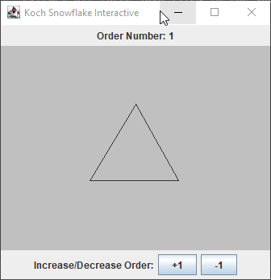

# Koch Snowflake
A simple GUI showcase which uses awt and swing components.

This Interactive application is based on the koch curve which is a fractal curve which shape retains the same general pattern regardless of how it is magnified. This application takes each edge of the snowflake and divides the edge into three segments of equal length. It then draws an equilateral triangle that has the middle segment from the previous step as its base then afterwards, removes the line segment that is the base of the triangle.

## How to run

`javac *.java` then `java KochSnowflakeApp`

## Example

